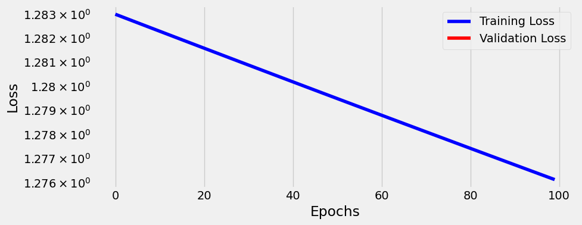

# BioNLP
> Useful fxns for DL with bio seqs


## Install

## How to use

Example starting with synthetic dataset generation.

```python
dna_dict = gen_dna_vocab(kmer=1)
dna_dict
```


    {'A': 1, 'T': 2, 'C': 3, 'G': 4, 'N': 5}


```python
synthetic_data = generate_Seqs_Exp_Dataset(50,10,30)
#First 5 Sequences
print('Raw Sequences')
print(synthetic_data['Seqs'][:5])
#First 5 Expression Values
print('\n\nExpression Values')
print(synthetic_data['Exp'][:5])
```

    Raw Sequences
    0                    TACTGTCGACAC
    1            GTCTTGGCACTAAGTTTGGA
    2    CCGAAGGGAGTTTATAAAAAGTGCGGAG
    3         GAGTTGTAGGCATCAGCTTGCAT
    4           TCTTTGTGCCCTAGGGAACAC
    Name: Seqs, dtype: object
    
    
    Expression Values
    0      -1.0949880814497355
    1    -0.029172588831908198
    2       1.8329884869450184
    3     0.024100108008603224
    4        0.887977884197582
    Name: Exp, dtype: object


```python
#create a Dataset which can be used with Pytorch Datasets/Dataloaders
synthetic_data.Exp = synthetic_data.Exp.astype(float)
dataset = DnaDataset(synthetic_data)
train_loader = DataLoader(dataset, batch_size=10)
```

```python
#view an example batch
sequence_batch, expression_batch = next(iter(train_loader))
```

```python
#first sequence/value in the first batch
print(sequence_batch[0])
print(expression_batch[0])
```

    tensor([[0., 0., 0., 0., 0., 0., 0., 0., 0., 0., 0., 0., 1., 1., 1., 1., 1., 1.,
             1., 1., 1., 1., 1., 1., 1., 1., 1., 1., 1.],
            [0., 1., 0., 0., 0., 0., 0., 0., 1., 0., 1., 0., 0., 0., 0., 0., 0., 0.,
             0., 0., 0., 0., 0., 0., 0., 0., 0., 0., 0.],
            [1., 0., 0., 1., 0., 1., 0., 0., 0., 0., 0., 0., 0., 0., 0., 0., 0., 0.,
             0., 0., 0., 0., 0., 0., 0., 0., 0., 0., 0.],
            [0., 0., 1., 0., 0., 0., 1., 0., 0., 1., 0., 1., 0., 0., 0., 0., 0., 0.,
             0., 0., 0., 0., 0., 0., 0., 0., 0., 0., 0.],
            [0., 0., 0., 0., 1., 0., 0., 1., 0., 0., 0., 0., 0., 0., 0., 0., 0., 0.,
             0., 0., 0., 0., 0., 0., 0., 0., 0., 0., 0.],
            [0., 0., 0., 0., 0., 0., 0., 0., 0., 0., 0., 0., 0., 0., 0., 0., 0., 0.,
             0., 0., 0., 0., 0., 0., 0., 0., 0., 0., 0.]])
    tensor(-1.0950)


```python
expression_batch[0]
```


    tensor(-1.0950)


#### Build and Train a CNN ; with randomly generated data

```python
model = baseline_cnn()
loss_fn = nn.MSELoss()
optimizer = torch.optim.SGD(model.parameters(),lr=1e-5)
sbs = StepByStep(model, loss_fn, optimizer)
sbs.set_loaders(train_loader)
sbs.train(100)
sbs.plot_losses()
```





